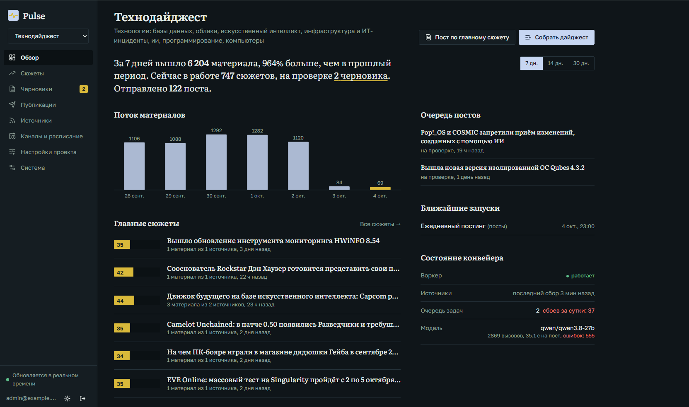
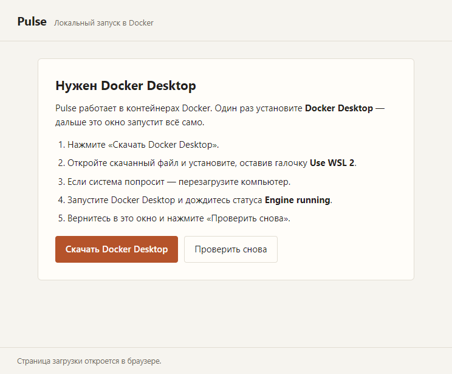
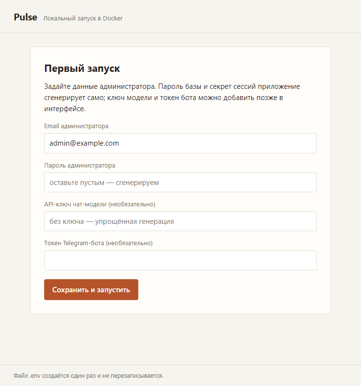
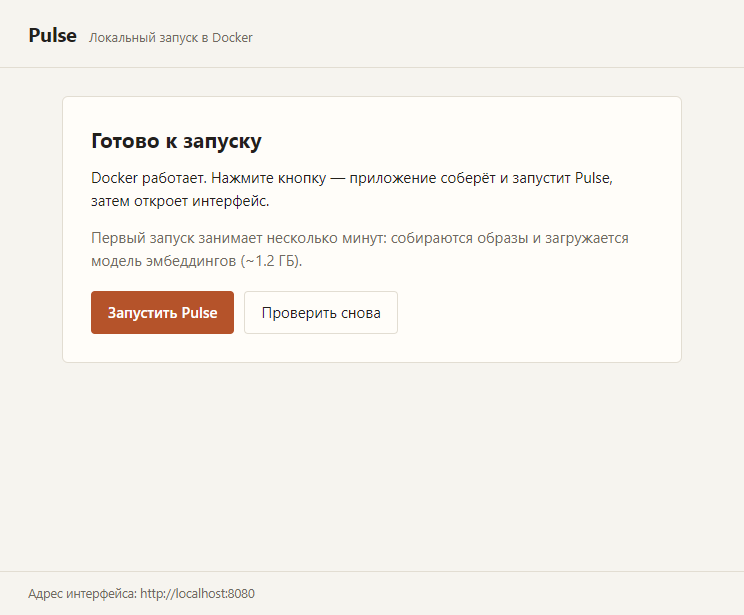
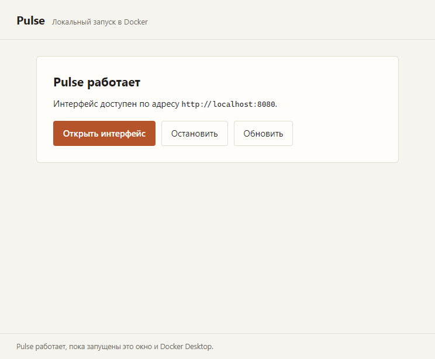

# Pulse

Self-hosted платформа, которая превращает поток новостей в посты для Telegram и webhook.
Читает подключённые RSS-источники, группирует материалы об одном событии в **сюжеты**, оценивает их вес, готовит черновик
и после проверки редактором (или автоматически) публикует.



*Рис. 1. Интерфейс платформы*

## Установка

Приложение работает внутри Docker, поэтому нужен только он: [Docker Desktop](https://www.docker.com/products/docker-desktop/)
на Windows и macOS либо Docker Engine с Compose plugin **2.24 или новее** на Linux (используются теги `!override`).
Дальше — один из двух способов.

### Windows: установщик

Скачайте [`Pulse-Setup-<версия>.exe`](https://github.com/marienbaum77/pulse/releases) и запустите его — исходники стека
встроены в пакет, поэтому git, Python и `npm` не нужны. Приложение установится в `%LOCALAPPDATA%\Programs\Pulse`,
на рабочем столе появится ярлык.

При первом запуске оно:

1. Проверяет Docker Desktop и, если его нет, предлагает скачать.
2. Создаёт `.env` со случайными паролями и секретами. Существующий `.env` не перезаписывается, поэтому приложение
   безопасно переустанавливать и обновлять.
3. Подбирает свободный порт: если `8080` занят другим экземпляром Pulse, берёт следующий свободный.
4. Собирает контейнеры, загружает модель эмбеддингов `bge-m3` и открывает интерфейс в отдельном окне.

#### Экраны первого запуска



*Рис. 2. Установите Docker Desktop и дождитесь статуса Engine running.*



*Рис. 3. Укажите email администратора. Пароль, ключ модели и токен бота можно задать сейчас или позже.*


*Рис. 4. Нажмите «Запустить Pulse»; при первом запуске загрузка образов и модели займёт несколько минут.*




*Рис. 5. После запуска откройте интерфейс Pulse в отдельном окне.*

Затем приложение спросит email и пароль администратора, ключ Groq и токен Telegram-бота; всё, кроме email, можно
пропустить — без ключа используется упрощённая генерация. Рабочая папка со стеком и `.env` — `%APPDATA%\Pulse\runtime`:
при желании тем же стеком можно управлять командами `docker compose` из этой папки.

Windows покажет предупреждение «Неизвестный издатель»: установщик не подписан сертификатом издателя, это ожидаемо.

## Быстрый старт

Ручной запуск — для Linux, macOS и для тех, кто предпочитает команду двойному клику.

```bash
cp .env.example .env
# задайте уникальные значения POSTGRES_PASSWORD и ADMIN_PASSWORD
# SECRET_KEY: openssl rand -hex 32
# LLM_API_KEY: ключ выбранного OpenAI-совместимого API (по умолчанию Groq)
docker compose up -d --build
docker compose exec ollama ollama pull bge-m3
docker compose exec api python -m app.seed      # опционально: пустой стартовый проект
```

В PowerShell вместо `cp` используйте `Copy-Item .env.example .env`. Откройте <http://localhost:8080>
и войдите под `ADMIN_EMAIL` / `ADMIN_PASSWORD`. Если не запускали `app.seed`, создайте проект
в интерфейсе; затем добавьте RSS-ленты на странице «Источники» (по одной или импортом OPML).
Для этого локального варианта HTTPS не настроен: не выставляйте его напрямую в интернет.
На локальном компьютере сбор и расписание работают только пока компьютер и Docker запущены;
для круглосуточной работы используйте VPS.

## Десктоп-приложение

Обёртка в каталоге `desktop/` ничего не меняет в самом приложении, а лишь управляет тем же `docker compose`: проверяет
Docker, при необходимости предлагает скачать Docker Desktop, создаёт `.env`, подбирает свободный порт, запускает стек
и открывает интерфейс в отдельном окне. Настройки и данные общие с ручным запуском, поэтому способы можно чередовать.

```bash
cd desktop
npm install
npm start         # запуск из исходников: работает со стеком этого репозитория
npm run dist      # установщик Windows: desktop/release/Pulse-Setup-<версия>.exe
```

`npm run dist:all` соберёт также dmg и AppImage. Установщик нужен только машине разработчика: он встраивает исходники
стека в себя, а приложение пользователя при первом запуске раскладывает их в `%APPDATA%\Pulse\runtime` (записываемый
каталог, существующий `.env` не перезаписывается) и запускает `docker compose` уже оттуда.


```bash
git tag v1.0.0 && git push origin v1.0.0   # опубликует Pulse-Setup-1.0.0.exe
```

## Развёртывание на VPS

Ниже — production-установка на Ubuntu с доменом и автоматическим HTTPS от Caddy.
В командах используется production Compose overlay; выполняйте их из корня клонированного репозитория.

### 1. Подготовьте сервер и домен

- Ubuntu 22.04/24.04 и Docker Engine с Compose plugin **2.24+** ([официальная установка Docker](https://docs.docker.com/engine/install/ubuntu/)).
- Для небольшого сервера ориентируйтесь на 1–2 vCPU, 2 ГБ RAM для приложения и ещё около 2 ГБ для локальной модели эмбеддингов `bge-m3`. Большая нагрузка или локальная чат-модель требуют дополнительных ресурсов.
- Создайте DNS-запись `A` для домена, указывающую на публичный IPv4 сервера. Если настроена запись `AAAA`, она тоже должна вести на этот сервер.
- Разрешите входящие TCP-порты 80 и 443 в firewall провайдера и на сервере; порт 22 оставьте доступным для SSH. Например, с UFW (перед включением убедитесь, что SSH разрешён):
  ```bash
  sudo ufw allow OpenSSH
  sudo ufw allow 80/tcp
  sudo ufw allow 443/tcp
  sudo ufw enable
  ```

### 2. Скачайте проект и подготовьте секреты

```bash
git clone https://github.com/marienbaum77/pulse.git
cd pulse
cp .env.example .env
openssl rand -hex 32
```

Отредактируйте `.env`:

- `POSTGRES_PASSWORD` — уникальный пароль базы. Для простого и надёжного значения сгенерируйте hex: `openssl rand -hex 32`.
- `SECRET_KEY` — вставьте отдельный результат `openssl rand -hex 32` (не используйте пароль базы повторно).
- `ADMIN_EMAIL` и `ADMIN_PASSWORD` — адрес и сильный пароль первого администратора.
- `PULSE_DOMAIN` — домен без `https://`, например `pulse.example.com`.
- `COOKIE_SECURE=true` — обязательно для production HTTPS.
- `LLM_API_KEY` — ключ провайдера чат-модели. По умолчанию используется Groq; для другого OpenAI-совместимого API задайте также его URL и имя модели. Без чат-модели можно выбрать `LLM_PROVIDER=stub`, но синтез будет упрощённым.

Не публикуйте `.env` и не отправляйте его в репозиторий. Не меняйте `SECRET_KEY` после запуска: это инвалидирует подписанные им сессии. `ADMIN_PASSWORD` используется только при создании первого администратора; последующее редактирование `.env` не сбросит существующий пароль.

### 3. Запустите Pulse

```bash
docker compose -f docker-compose.yml -f docker-compose.prod.yml up -d --build
docker compose -f docker-compose.yml -f docker-compose.prod.yml exec ollama ollama pull bge-m3
docker compose -f docker-compose.yml -f docker-compose.prod.yml exec api python -m app.seed
```

`app.seed` необязателен: он создаёт пустой стартовый проект с консольным каналом, но не добавляет демонстрационные ленты или новости. Миграции базы применяются автоматически при старте API и worker.

Проверьте запуск и журналы:

```bash
docker compose -f docker-compose.yml -f docker-compose.prod.yml ps
docker compose -f docker-compose.yml -f docker-compose.prod.yml logs --tail=100 api worker caddy
```

Когда сервисы запущены и DNS уже обновился, откройте `https://<PULSE_DOMAIN>` и войдите под `ADMIN_EMAIL` / `ADMIN_PASSWORD`. В приложении задайте тему проекта, добавьте RSS-источники и настройте канал и расписание публикаций. Pulse не начинает публиковать сам, пока не настроены проект, источники, канал и расписание.

### 4. Настройте публикацию

Для Telegram создайте бота через [@BotFather](https://t.me/BotFather), добавьте его администратором канала с правом публикации и задайте `TELEGRAM_BOT_TOKEN` в `.env`. После изменения конфигурации пересоздайте сервисы:

```bash
docker compose -f docker-compose.yml -f docker-compose.prod.yml up -d
```

Затем в интерфейсе откройте «Каналы и расписание → Добавить канал → Telegram», укажите `@имя_канала` и проверьте доступ. Подробности режимов публикации приведены в разделе [«Режимы публикации»](#режимы-публикации).

### Переменные окружения

Образец со всеми значениями по умолчанию находится в [.env.example](./.env.example). Обязательные для старта значения отмечены `:?` в Compose: `POSTGRES_PASSWORD`, `SECRET_KEY` и `ADMIN_PASSWORD`.

| Переменная | Назначение |
|---|---|
| `POSTGRES_PASSWORD` | Пароль PostgreSQL; задайте до первого запуска и храните отдельно. |
| `SECRET_KEY` | Секрет подписи сессий, не короче 32 символов. Сгенерируйте `openssl rand -hex 32`; не меняйте после запуска. |
| `ADMIN_EMAIL`, `ADMIN_PASSWORD` | Учётные данные первого администратора. Пароль из `.env` применяется только при создании первого пользователя. |
| `PULSE_PORT` | Порт веб-интерфейса на хосте (по умолчанию `8080`; десктоп-приложение при занятости подбирает свободный). В production доступен только с самого сервера за Caddy. |
| `PULSE_DOMAIN` | Только для production overlay: домен Caddy, например `pulse.example.com`. |
| `COOKIE_SECURE` | `true` для HTTPS (обязательно для production), `false` для локального HTTP. |
| `LLM_PROVIDER`, `LLM_CHAT_ENABLED` | Провайдер чат-модели и включение генерации. `stub` отключает вызовы чат-модели. |
| `LLM_BASE_URL`, `LLM_API_KEY`, `LLM_MODEL`, `LLM_TIMEOUT` | URL, API-ключ, имя модели и таймаут запросов к OpenAI-совместимому API. |
| `EMBED_MODEL`, `EMBED_BASE_URL`, `EMBED_API_KEY` | Модель и endpoint эмбеддингов. По умолчанию `bge-m3` загружается в Ollama из стека. |
| `OLLAMA_CONTEXT_LENGTH`, `OLLAMA_KEEP_ALIVE`, `OLLAMA_MAX_LOADED_MODELS`, `OLLAMA_NUM_PARALLEL` | Ограничения памяти и параллелизма Ollama; значения по умолчанию подходят для небольшого сервера. |
| `WORKER_CONCURRENCY` | Число фоновых worker-процессов; при локальной генерации на ограниченной памяти уменьшите до `1`. |
| `TELEGRAM_BOT_TOKEN` | Необязательный токен бота для публикации в Telegram. |
| `ALLOW_PRIVATE_URLS` | По умолчанию `false`: запрещает RSS-источникам и webhook обращаться к внутренним адресам. Включайте только если понимаете последствия. |
| `RETENTION_DAYS` | Срок хранения данных, для которых предусмотрена очистка (по умолчанию 30 дней). |
| `BACKUP_KEEP_DAYS`, `BACKUP_KEEP_COUNT` | Ротация локальных дампов: по умолчанию не старше 14 дней и максимум 7 файлов. |
| `BACKUP_INTERVAL_HOURS`, `BACKUP_STRIP_VECTORS` | Интервал резервного копирования (24 часа) и исключение пересчитываемых векторов из дампа (`true`). |
| `IMAGE_CACHE_MAX_MB`, `IMAGE_CACHE_MAX_AGE_DAYS` | Максимальный размер и срок хранения кэша изображений. |

После изменения `.env` примените настройки командой `docker compose -f docker-compose.yml -f docker-compose.prod.yml up -d`. Для локальной установки используйте `docker compose up -d`.

### Обновление, остановка и резервные копии

Данные PostgreSQL и Ollama хранятся в Docker volumes и переживают пересоздание контейнеров. Для остановки production-стека выполните `docker compose -f docker-compose.yml -f docker-compose.prod.yml down`; эта команда сохраняет volumes. **Не добавляйте `-v`**, если не хотите удалить базу и загруженные модели.

Для обновления из Git:

```bash
git pull --ff-only
docker compose -f docker-compose.yml -f docker-compose.prod.yml up -d --build
docker compose -f docker-compose.yml -f docker-compose.prod.yml logs --tail=100 api worker
```

Перед крупным обновлением убедитесь, что есть свежий дамп. Миграции запускаются автоматически при старте; дамп позволяет восстановить данные, если обновление не удалось.

Контейнер `backup` создаёт сжатый дамп PostgreSQL в `./backups` примерно раз в сутки и удаляет старые по `BACKUP_KEEP_DAYS` / `BACKUP_KEEP_COUNT`. Первая копия появляется вскоре после запуска backup-сервиса. Дампы не содержат векторы (они пересчитываются) и таблицы `jobs` / `llm_calls`; каталог находится на том же диске, что и сервер, поэтому периодически копируйте дампы в отдельное защищённое хранилище.

Проверьте наличие файлов:

```bash
ls -lh backups/
docker compose -f docker-compose.yml -f docker-compose.prod.yml logs --tail=50 backup
```

**Восстановление заменяет текущую базу целиком. Сначала сохраните текущие данные.** Выберите нужный файл дампа, остановите сервисы, подключающиеся к базе, пересоздайте пустую БД и импортируйте SQL:

```bash
docker compose -f docker-compose.yml -f docker-compose.prod.yml stop api worker backup
docker compose -f docker-compose.yml -f docker-compose.prod.yml exec -T db dropdb -U pulse pulse
docker compose -f docker-compose.yml -f docker-compose.prod.yml exec -T db createdb -U pulse pulse
gzip -dc backups/pulse-ДАТА.sql.gz | docker compose -f docker-compose.yml -f docker-compose.prod.yml exec -T db psql -v ON_ERROR_STOP=1 -U pulse -d pulse
docker compose -f docker-compose.yml -f docker-compose.prod.yml up -d
```

Замените `pulse-ДАТА.sql.gz` на имя нужного файла. После восстановления API автоматически применит миграции; векторы будут созданы заново.

### Устранение неполадок

- **Caddy не выдаёт сертификат:** проверьте `PULSE_DOMAIN`, DNS-записи `A`/`AAAA` и доступность TCP 80/443 снаружи, затем посмотрите `logs caddy`.
- **Не открывается сайт:** выполните `ps`, проверьте журналы `web`, `api` и `caddy`; в production порт `PULSE_PORT` привязан только к loopback, внешний доступ идёт через домен и Caddy.
- **`port is already allocated`:** порт `PULSE_PORT` занят другим стеком — укажите в `.env` свободный и выполните `docker compose up -d`. Десктоп-приложение подбирает порт само.
- **Нет генерации или эмбеддингов:** проверьте ключ/URL/название чат-модели, наличие `bge-m3` командой `docker compose -f docker-compose.yml -f docker-compose.prod.yml exec ollama ollama list` и логи `api`/`worker`.
- **Не хватает места:** проверьте `df -h` и содержимое `backups/`; настройки ротации ограничивают количество и возраст бэкапов, но не заменяют контроль свободного места.

## Настройка

### Источники

Pulse читает только подключённые вами ленты:
- **Добавить RSS-ленту** или **импортировать OPML** (из Feedly, Inoreader и др.).
- **Искать статьи** — поисковый запрос превращается в Google News RSS-ленту; найденные URL проходят обычный конвейер. Уточняйте широкие запросы (`"Python разработка" -змея`, `site:habr.com`).
- Короткие RSS-фрагменты Pulse дозагружает со страницы статьи (лимит 2 МБ, защита от SSRF).
- Материалы старше окна проекта (`window_hours`, по умолчанию 48 ч) считаются устаревшими и в сюжеты не попадают.

### Модели

| Компонент | Назначение |
|---|---|
| Эмбеддер (по умолчанию bge-m3 через Ollama) | группировка материалов в сюжеты и сравнение заголовков сюжета с темой проекта |
| Чат-модель (по умолчанию Groq) | синтез одного поста из нескольких источников, перевод |

Режимы:
- **По умолчанию** — локальный bge-m3 + облачный чат по OpenAI-совместимому API.
- **`LLM_PROVIDER=stub`** — без чат-модели: пост собирается из предложений источников, сюжеты находятся хуже.
- **Своя модель** — любой OpenAI-совместимый сервер (Ollama, vLLM, облако): `LLM_BASE_URL`, `LLM_API_KEY`, `LLM_MODEL`; для эмбеддингов отдельно `EMBED_BASE_URL`, `EMBED_API_KEY`, `EMBED_MODEL`.

Модели можно менять в интерфейсе: **Система → Состояние → Модели**. Смена эмбеддера безопасна: векторы и сюжеты пересчитываются автоматически.
Тексты источников отправляются выбранному провайдеру — учитывайте его политику конфиденциальности. Для хорошего синтеза нужны модели 14B+ или внешний API.

### Режимы публикации

Задаются в «Настройки проекта → Публикация»:
- **Ручное утверждение** — каждый пост ждёт решения редактора («Черновики → На проверке»).
- **Полуавтоматически** — пост проходит автопроверки (источники, длина, заголовок, язык); без замечаний уходит в каналы сам, иначе остаётся на проверке с причиной.
- **Автопубликация** — обычные замечания не задерживают пост; на проверке остаются только пустой/слишком короткий текст, неполученная короткая статья (при единственном источнике) и несоответствие языку.

Нужен хотя бы один включённый канал. Автопроверки не заменяют проверку фактов. Расписание генерации задаётся в «Каналы и расписание».

### Telegram

1. Создайте бота у [@BotFather](https://t.me/BotFather) и добавьте его администратором канала с правом публикации.
2. Укажите `TELEGRAM_BOT_TOKEN` в `.env` и пересоздайте сервисы. Для production VPS:
   ```bash
   docker compose -f docker-compose.yml -f docker-compose.prod.yml up -d
   ```
   Для локального запуска используйте `docker compose up -d`.
3. «Каналы и расписание → Добавить канал → Telegram», введите `@имя_канала`, нажмите «Проверить доступ» (ничего не публикует).

Подписчикам уходят заголовок, текст и названия источников; номера `[1]`, `[2]` убираются. Картинка идёт тем же сообщением, а если текст длиннее лимита подписи — отдельным сообщением перед текстом. Повторная отправка того же текста в канал блокируется на 24 часа.

### Пароль администратора

`ADMIN_PASSWORD` применяется только при первом запуске. Сброс:

```bash
docker compose -f docker-compose.yml -f docker-compose.prod.yml exec api python -m app.admin reset-password [--email user@example.com]
docker compose -f docker-compose.yml -f docker-compose.prod.yml exec api python -m app.admin list-users
```

Для локальной установки опустите `-f docker-compose.yml -f docker-compose.prod.yml`.

### Порог сходства

«Порог сходства» определяет, когда два материала считаются одним событием. Подобрать его на размеченных данных:

```bash
docker compose -f docker-compose.yml -f docker-compose.prod.yml exec api python scripts/eval_clustering.py --data /app/sample_data/demo_news_hard.jsonl --provider stub   # проверка скрипта
docker compose -f docker-compose.yml -f docker-compose.prod.yml exec -T api python scripts/export_for_labeling.py --project 1 > to_label.csv                              # выгрузка для разметки
docker compose -f docker-compose.yml -f docker-compose.prod.yml exec -T api python scripts/eval_clustering.py --data - --format csv --provider openai < to_label.csv     # оценка
```

В `to_label.csv` исправьте колонку `gold` (одинаковая метка = одно событие), затем перенесите лучший порог в настройки проекта. Для локального запуска используйте `docker compose` без production overlay.

## Разработка

```bash
docker compose -f docker-compose.yml -f docker-compose.dev.yml up --build   # интерфейс :5173, API :8000 (/api/docs)
```

Тесты выполняются на отдельной БД (они очищают данные):

```powershell
.\backend\scripts\test-docker.ps1      # Linux/macOS: sh backend/scripts/test-docker.sh
```

Без Docker нужны Python 3.12, Node 22, PostgreSQL 16 + pgvector: `pip install -r backend/requirements-dev.txt`, `uvicorn app.main:app --reload`, `python -m app.worker`, `cd web && npm install && npm run dev`.
При прямом запуске `pytest` `DATABASE_URL` должен указывать на базу с именем на `_test`.

## Архитектура

| Компонент | Что делает |
|---|---|
| `backend/app/api` | FastAPI-роутеры по областям: `projects`, `sources`, `channels`, `schedules`, `content`, `auth`, `system` |
| `backend/app/pipeline` | сбор, кластеризация, оценка, генерация, публикация черновиков |
| `backend/app/worker.py` | планировщик, очередь задач, обработка, отправка |
| PostgreSQL + pgvector | данные, векторы, очередь (`SKIP LOCKED`), события (`LISTEN/NOTIFY`) |
| `web` (React, Vite) | интерфейс редактора за nginx |

- **Сюжет** — группа материалов об одном событии (с весом); **черновик** — текст поста по сюжету или дайджесту.
- **Вес сюжета** — взвешенная сумма признаков; главный — сходство заголовков с темой проекта, вторичные — охват, авторитетность источников, свежесть, скорость роста. Тексты статей не участвуют в оценке соответствия теме, чтобы посторонний текст страницы не перевешивал заголовок.
- Источники в тексте помечаются `[n]`, по ним строятся автопроверки.
- Картинки не хранятся в БД: берутся из RSS или `og:image` и отдаются через прокси API.

## Ограничения

- Только RSS/Atom и поиск через Google News RSS; полный обход сайтов и JavaScript-страницы не поддерживаются.
- Автопроверки эвристические.
- Слабые локальные модели пишут посты хуже; на CPU генерация медленная.
