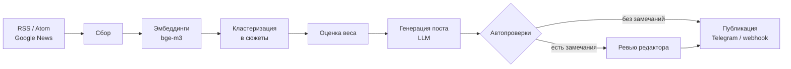
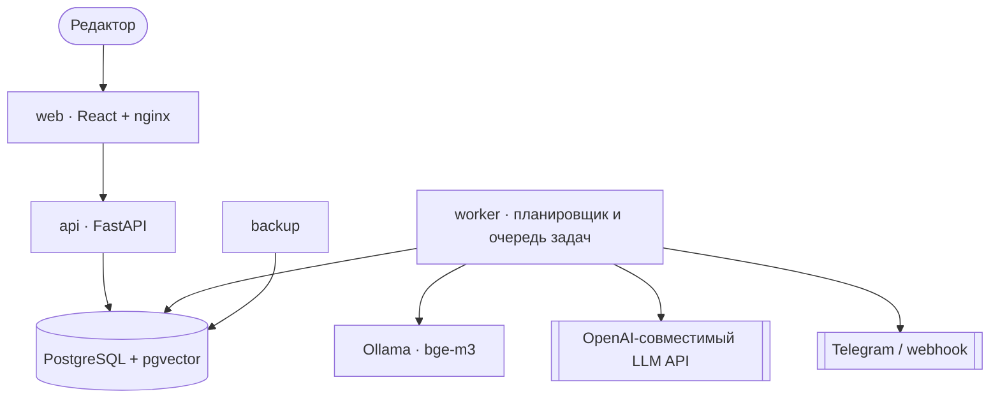

<div align="center">

# Pulse

**Self-hosted платформа, которая превращает поток новостей в готовые посты для Telegram и webhook.**

Читает RSS-источники, группирует материалы об одном событии в сюжеты, оценивает их вес,
пишет черновик через LLM и публикует — после проверки редактором или автоматически.

[](https://github.com/marienbaum77/pulse/actions/workflows/ci.yml)
[](LICENSE)


[](https://www.docker.com/products/docker-desktop/)

[Установка](docs/install.md) · [VPS](docs/deploy-vps.md) · [Конфигурация](docs/configuration.md) · [Разработка](docs/development.md) · [Безопасность](docs/security.md)


</div>

## Возможности

- **Сбор** — RSS/Atom и поиск через Google News RSS, импорт OPML, дозагрузка полного текста статьи.
- **Сюжеты** — материалы об одном событии группируются по эмбеддингам (`bge-m3`) и получают вес:
  близость к теме проекта, охват, авторитетность источников, свежесть, скорость роста.
- **Генерация** — один пост из нескольких источников через любой OpenAI-совместимый API (Groq, Ollama, vLLM)
  или упрощённый режим без LLM (`LLM_PROVIDER=stub`).
- **Публикация** — Telegram и webhook; режимы: ручное утверждение, полуавтоматический, автопубликация.
- **Десктоп** — установщик для Windows (Electron) с встроенным стеком Docker.
- **Безопасность** — защита от SSRF, подписанные webhook, Argon2id, ротация бэкапов.

## Как это работает



## Быстрый старт

Нужен только [Docker](https://www.docker.com/products/docker-desktop/) (Compose plugin **2.24+**).

**Windows** — скачайте `Pulse-Setup-<версия>.exe` со страницы [Releases](https://github.com/marienbaum77/pulse/releases)
и запустите: git, Python и npm не нужны. Подробности и скриншоты — в [docs/install.md](docs/install.md).

**Linux / macOS**

```bash
git clone https://github.com/marienbaum77/pulse.git && cd pulse
cp .env.example .env        # задайте POSTGRES_PASSWORD, ADMIN_PASSWORD, SECRET_KEY (openssl rand -hex 32)
docker compose up -d --build
docker compose exec ollama ollama pull bge-m3
```

Откройте <http://localhost:8080> и войдите под `ADMIN_EMAIL` / `ADMIN_PASSWORD`, создайте проект
и добавьте RSS-ленты на странице «Источники». Без `LLM_API_KEY` работает упрощённая генерация.

> Локальный вариант без HTTPS — не выставляйте его в интернет. Для круглосуточной работы
> используйте [VPS с Caddy и автоматическим HTTPS](docs/deploy-vps.md).

## Архитектура



Очередь задач и события работают на самой PostgreSQL (`SKIP LOCKED`, `LISTEN/NOTIFY`), отдельный брокер не нужен.
Подробнее о модулях и конвейере — в [docs/development.md](docs/development.md#архитектура).

## Структура репозитория

```text
pulse/
├── backend/          # FastAPI: api/, pipeline/, worker, миграции (SQL), тесты
├── web/              # React + Vite + TypeScript — интерфейс редактора
├── desktop/          # Electron-обёртка и установщик для Windows
├── deploy/           # Caddyfile, nginx.conf, скрипт бэкапа
├── docs/             # установка, конфигурация, VPS, бэкапы, безопасность
├── sample_data/      # демо-новости для оценки кластеризации
├── docker-compose*.yml   # base + dev / prod / test overlays
└── .github/          # CI, релизный workflow, шаблоны issue и PR
```

## Документация

| Раздел | О чём |
|---|---|
| [Установка](docs/install.md) | установщик Windows, ручной запуск, десктоп-приложение |
| [Развёртывание на VPS](docs/deploy-vps.md) | Ubuntu, домен, HTTPS через Caddy |
| [Конфигурация](docs/configuration.md) | переменные `.env`, модели, режимы публикации, Telegram, порог сходства |
| [Разработка](docs/development.md) | локальный запуск, тесты, архитектура |
| [Безопасность](docs/security.md) | сессии, webhook, SSRF, заголовки |
| [Бэкапы](docs/backup.md) · [Неполадки](docs/troubleshooting.md) | резервные копии, восстановление, типичные проблемы |

## Ограничения

- Только RSS/Atom и поиск через Google News RSS; обход сайтов и JavaScript-страницы не поддерживаются.
- Автопроверки эвристические и не заменяют проверку фактов.
- Слабые локальные модели пишут хуже; на CPU генерация и разбор тысяч материалов медленные.
- Тексты источников отправляются выбранному LLM-провайдеру — учитывайте его политику конфиденциальности.

## Участие и лицензия

Правила — в [CONTRIBUTING.md](CONTRIBUTING.md), об уязвимостях — в [SECURITY.md](SECURITY.md),
история изменений — в [CHANGELOG.md](CHANGELOG.md). Лицензия: [MIT](LICENSE).
